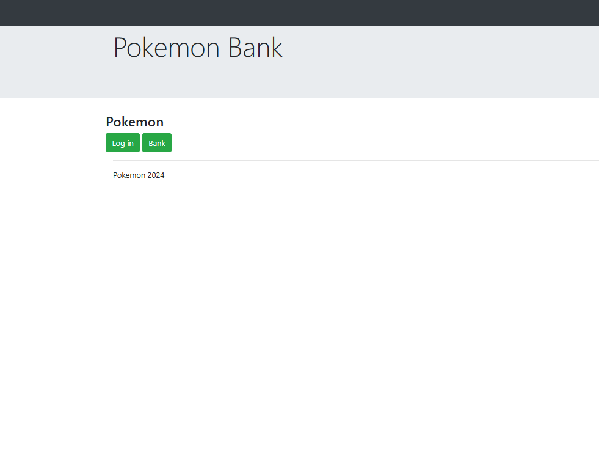
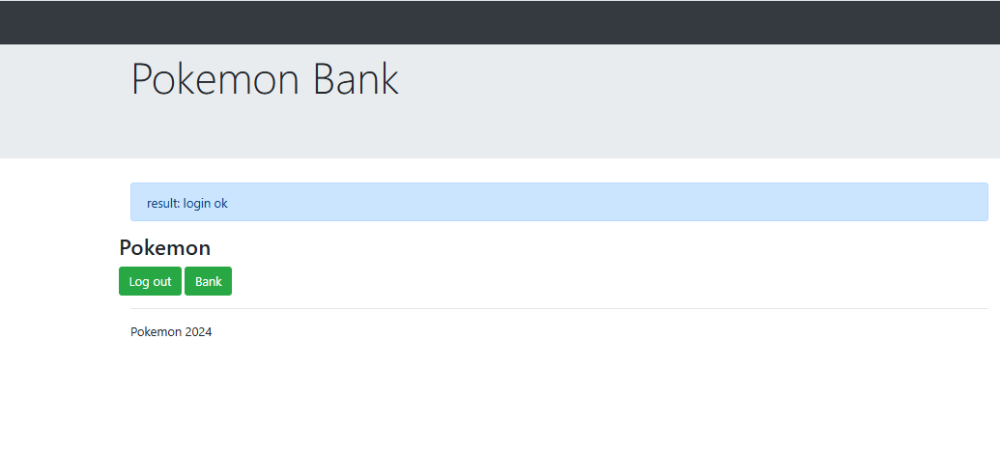
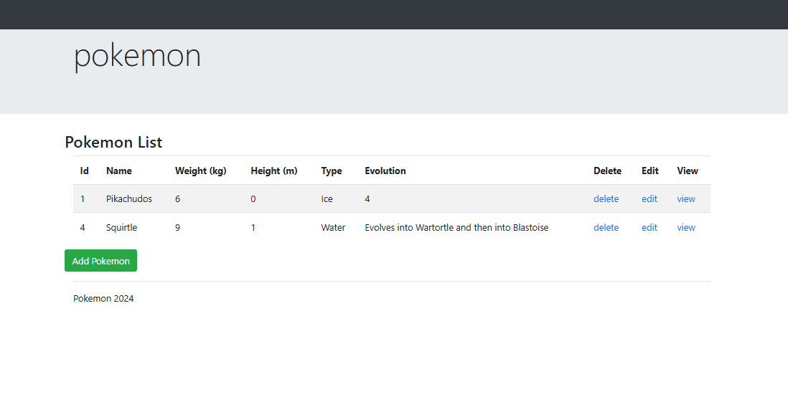
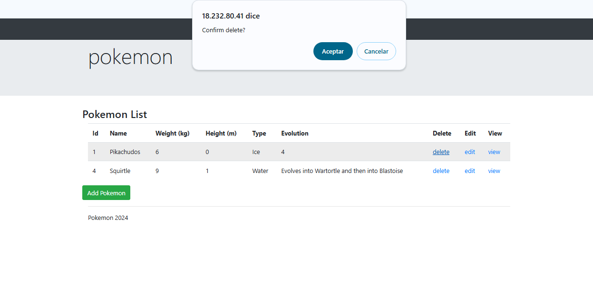
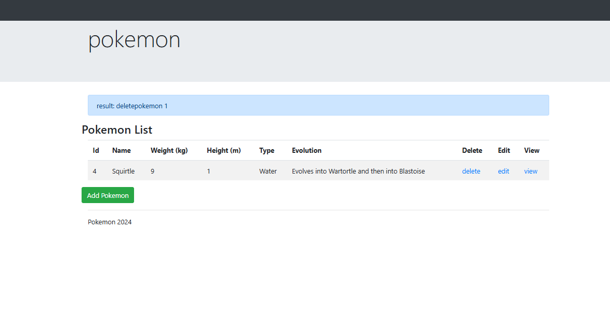
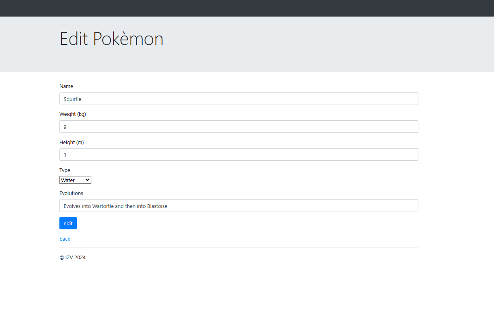
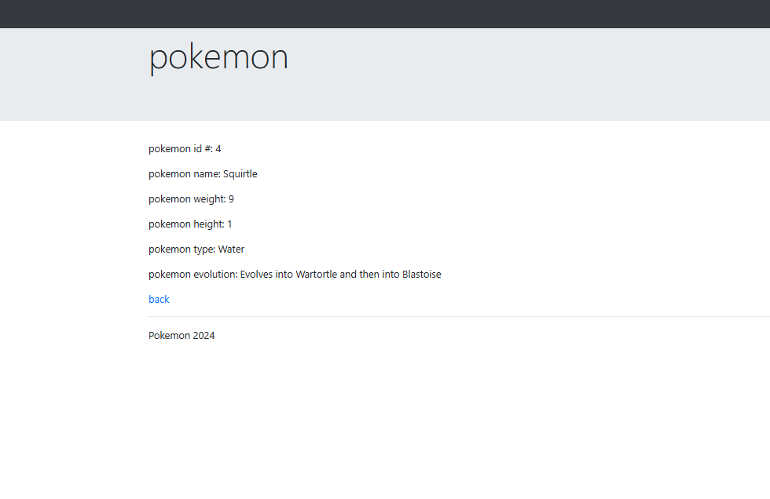
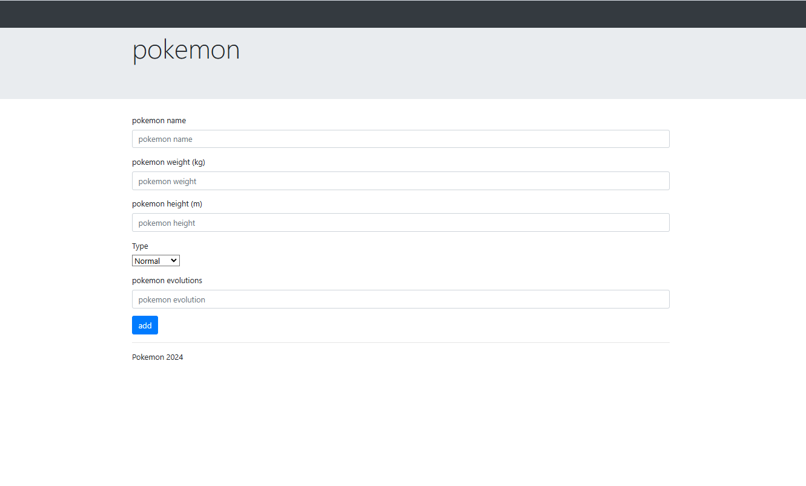

# Pokemon Bank

Una aplicación web PHP para gestionar una base de datos de Pokemon con operaciones CRUD básicas.

**Características**

Autenticación de usuarios (inicio/cierre de sesión)

**Gestión de Pokemon:**

Ver lista de Pokemon
Añadir nuevos Pokemon
Editar Pokemon existentes
Eliminar Pokemon
Ver detalles de Pokemon
Atributos de Pokemon:
Nombre
Peso (kg)
Altura (m)
Tipo (Normal, Fuego, Agua, etc.)
Evolución
Detalles Técnicos
Desarrollado con PHP y MySQL

Usa PDO para operaciones de base de datos
Autenticación basada en sesiones
Validación y sanitización de inputs
Diseño responsive
Configuración de Base de Datos

´´´bash
CREATE DATABASE pokemon;
CREATE USER 'pokemon'@'localhost' IDENTIFIED BY 'user';
GRANT ALL PRIVILEGES ON pokemon.* TO 'pokemon'@'localhost';
FLUSH PRIVILEGES;
´´´

## Características de Seguridad

Autenticación basada en sesiones
Consultas SQL preparadas para prevenir inyección SQL
Validación y sanitización de inputs
Protección CSRF mediante tokens de sesión
Requisitos
PHP 7.0+
MySQL 5.7+
Servidor web (Apache/Nginx)

## Capturas

